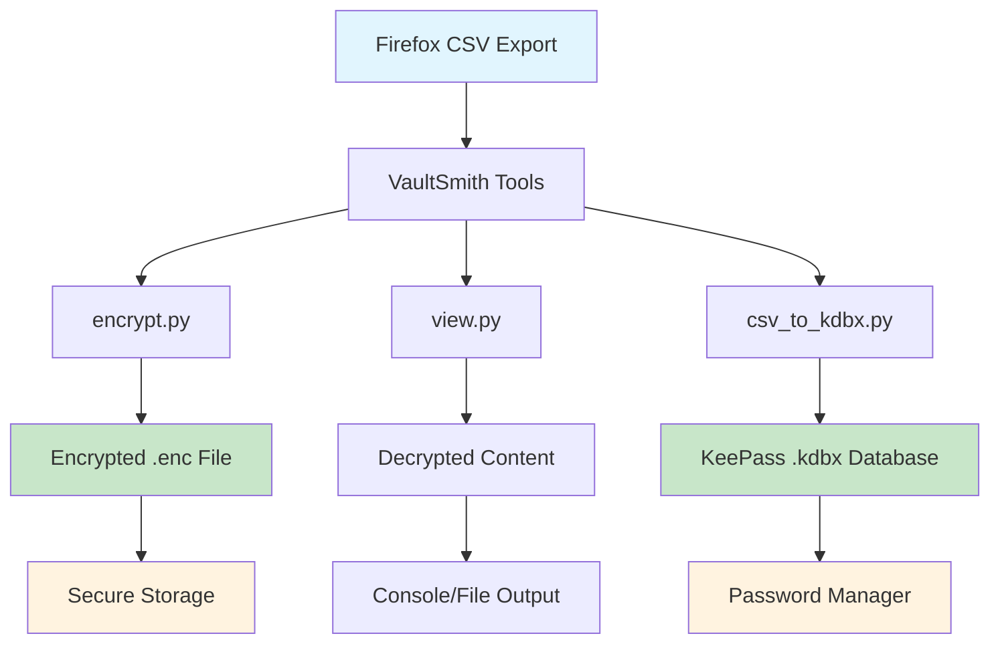
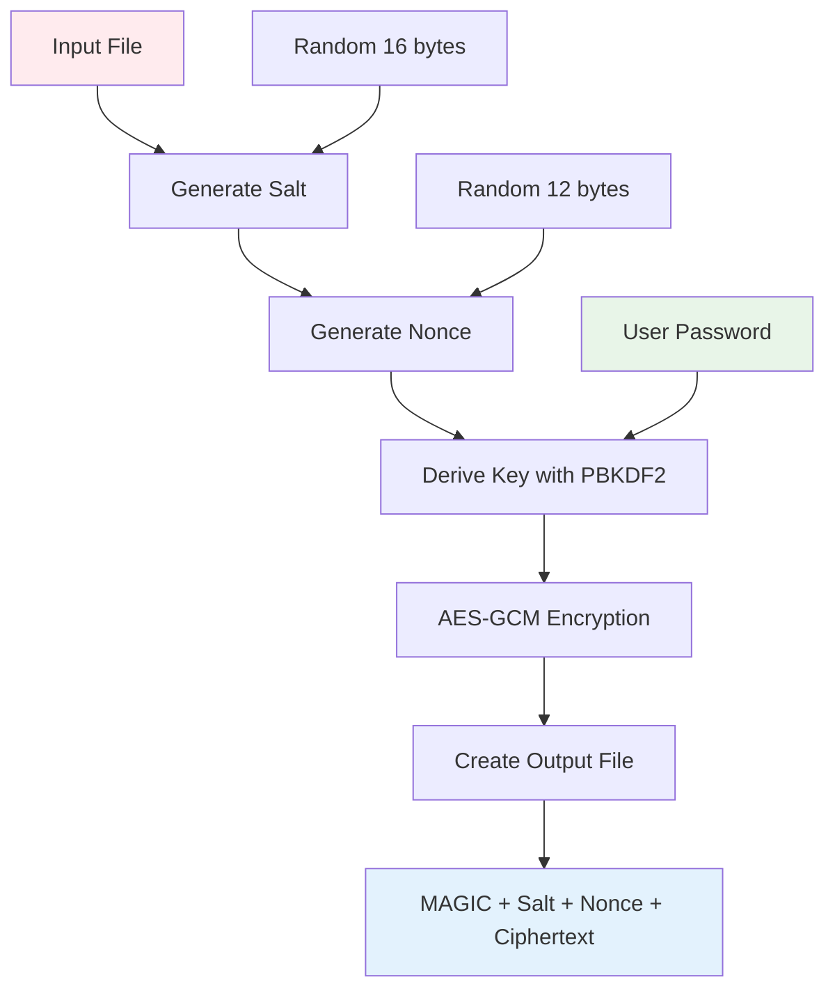
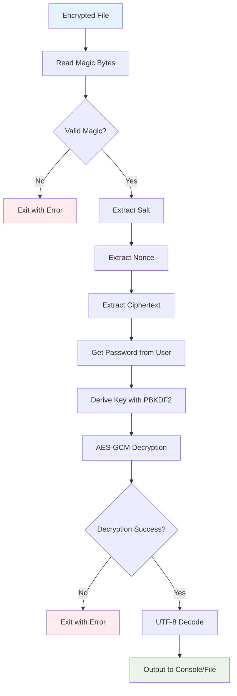
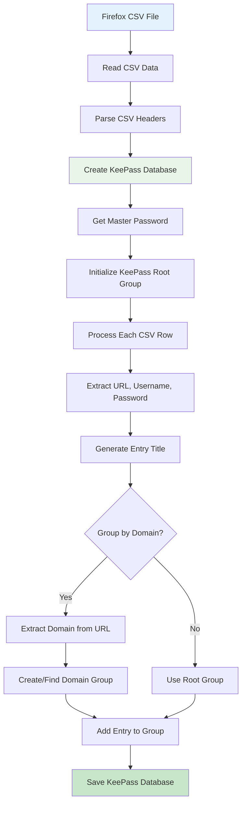

# VaultSmith - Secure Bridge Between Firefox and KeePass


## Project Overview

**VaultSmith** is a specialized tool for secure password migration from Firefox to KeePass, providing cryptographic protection for exported data and automated conversion to `.kdbx` format.

### Project Goals
- Secure encryption of passwords exported from Firefox
- Automated conversion of CSV files to KeePass format
- Implementation of modern cryptographic standards
- Ensuring complete autonomy (no dependency on cloud services)

## System Architecture

### Modular Structure

The project is built on the **Single Responsibility Principle** with three main modules:



```
VaultSmith/
├── encrypt.py          # File encryption module
├── view.py             # Decryption and viewing module
├── csv_to_kdbx.py      # KeePass format conversion module
├── requirements.txt    # Project dependencies
└── README.md          # Documentation
```

### Architectural Principles

1. **Single Responsibility Principle**: Each module has a clearly defined function
2. **Cryptographic Security**: Use of proven algorithms (AES-GCM, PBKDF2)
3. **Modularity**: Independent components that can work separately
4. **Password Security**: Use of `getpass` for secure password input

## Detailed Module Analysis

### 1. Encryption Module (`encrypt.py`)

**Purpose**: Encryption of arbitrary files (primarily CSV) into a secure binary format.

**Key Functions**:
```python
def derive_key(password: bytes, salt: bytes, iterations: int = 200_000) -> bytes:
    """Generate cryptographic key from password"""
```

**Architectural Features**:
- **PBKDF2-HMAC-SHA256** for key derivation
- **AES-GCM** for authenticated encryption
- **200,000 iterations** for brute-force protection
- **Unique salt and nonce** for each file

**Output File Format**:
```
[MAGIC(8)] [salt(16)] [nonce(12)] [ciphertext...]
```

### Encryption Process Flow



### 2. Viewing Module (`view.py`)

**Purpose**: Secure decryption and viewing of encrypted files.

**Architectural Features**:
- Magic bytes validation for format verification
- Decryption error handling
- Support for file or console output
- UTF-8 decoding with error handling

### Decryption Process Flow



### 3. Conversion Module (`csv_to_kdbx.py`)

**Purpose**: Conversion of Firefox CSV export to KeePass format.

**Key Functions**:
```python
def domain_from_url(url: str) -> str:
    """Extract domain from URL for grouping"""

def read_firefox_csv(path):
    """Read and parse Firefox CSV export"""
```

**Architectural Features**:
- **Field Flexibility**: Support for various CSV formats
- **Automatic Grouping**: Organization of entries by domains
- **Keyfile Support**: Additional security factor
- **Data Validation**: File existence and password verification

### CSV to KeePass Conversion Process



## Development Approaches

### 1. Microservice Architecture
Each module can work independently, ensuring:
- Ease of testing
- Development modularity
- Maintenance simplicity

### 2. Security as Priority
- **Defense in depth**: Multiple protection layers
- **Cryptographic best practices**: Use of proven algorithms
- **Secure defaults**: Secure settings by default

### 3. User Experience
- **CLI Interface**: Ease of use
- **Informative Messages**: Clear error messages
- **Configuration Flexibility**: Multiple configuration options

### 4. Code Style and Standards
```python
# Example of PEP 8 compliance and best practices
def derive_key(password: bytes, salt: bytes, iterations: int = 200_000) -> bytes:
    """Generate key using PBKDF2-HMAC-SHA256.
    
    Args:
        password: User password in bytes
        salt: Random salt for uniqueness
        iterations: Number of iterations (default 200,000)
    
    Returns:
        bytes: Derived cryptographic key
    """
```

## Cryptographic Standards

### Encryption Algorithms
- **AES-GCM-256**: Authenticated encryption with integrity verification
- **PBKDF2-HMAC-SHA256**: Key derivation from passwords
- **Argon2id**: Modern memory-hard KDF (planned)

### Security Parameters
- **Salt**: 16 bytes of random data
- **Nonce**: 12 bytes for AES-GCM
- **Iterations**: 200,000 for PBKDF2
- **Key Length**: 256 bits

## Development Roadmap

### Short-term Goals
- [ ] Integration of Argon2id as primary KDF
- [ ] Improved error handling
- [ ] Addition of unit tests

### Long-term Goals
- [ ] GUI interface (Tauri/Electron)
- [ ] Support for other browsers
- [ ] Integration with KeePassXC CLI
- [ ] Automatic secure-delete

## Quick Start

### Installing Dependencies
```bash
pip install -r requirements.txt
```

### Basic Usage
```bash
# 1. Encrypt CSV
python encrypt.py export.csv export.enc

# 2. Decrypt
python view.py export.enc

# 3. Convert to KeePass
python csv_to_kdbx.py export.csv passwords.kdbx --group-by-domain
```

## License

MIT License - see `LICENSE` file for details.

## Important Warnings

- VaultSmith is intended **only for your own credentials**
- Always **delete original CSV files** after encryption
- Use **strong passwords** (16+ characters)
- **Regularly update** dependencies

---

> **Forge your own vaults.**  
> VaultSmith - your forge of digital security.
