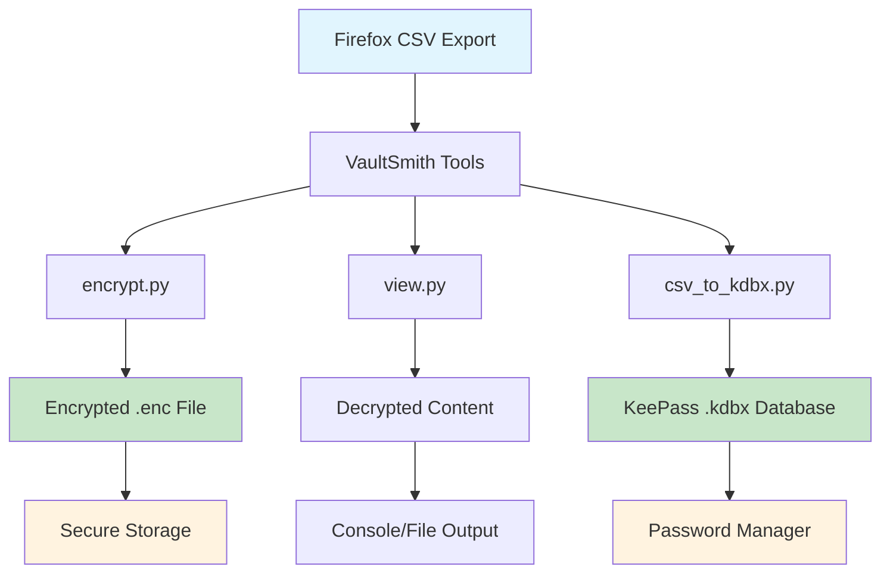
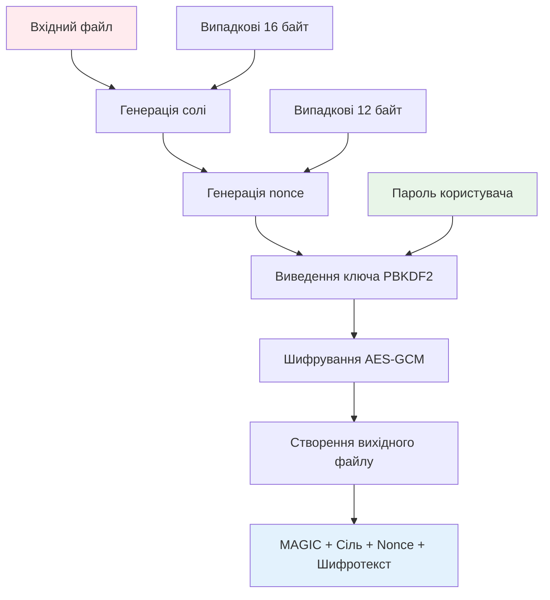
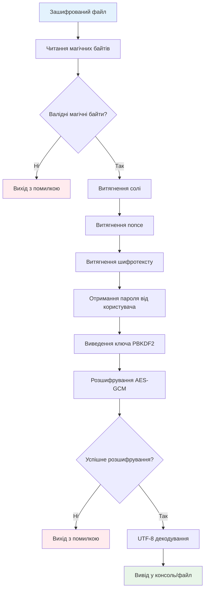
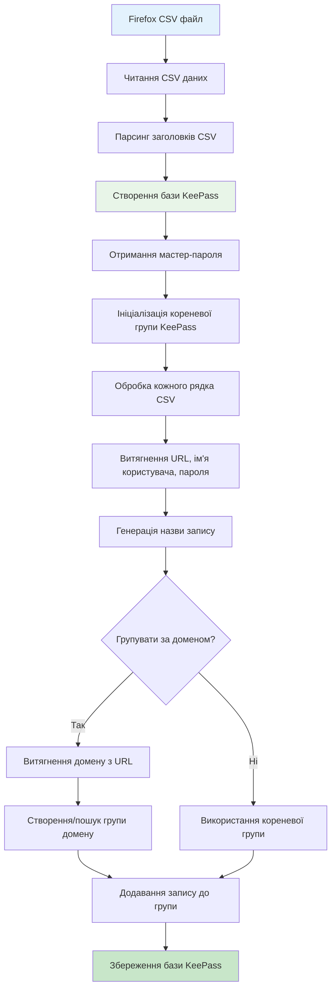

# VaultSmith - безпечний міст між Firefox і KeePass


## Огляд проекту

**VaultSmith** - це спеціалізований інструмент для безпечної міграції паролів з Firefox у KeePass, який забезпечує криптографічний захист експортованих даних та автоматизовану конвертацію у формат `.kdbx`.

### Основни цілі проекту
- Забезпечення безпечного шифрування експортованих з Firefox паролів
- Автоматизована конвертація CSV-файлів у формат KeePass
- Застосування сучасних криптографічних стандартів
- Забезпечення повної автономності (без залежності від хмарних сервісів)

## Архітектура системи

### Модульна структура

Проект побудований за принципом **Single Responsibility Principle** з трьома основними модулями:



```
VaultSmith/
├── encrypt.py          # Модуль шифрування файлів
├── view.py             # Модуль розшифрування та перегляду
├── csv_to_kdbx.py      # Модуль конвертації у KeePass формат
├── requirements.txt    # Залежності проекту
└── README.md          # Документація
```

### Архітектурні принципи

1. **Принцип єдиної відповідальності**: Кожен модуль має чітко визначену функцію
2. **Криптографічна безпека**: Використання перевірених алгоритмів (AES-GCM, PBKDF2)
3. **Модульність**: Незалежні компоненти, що можуть працювати окремо
4. **Безпека паролів**: Використання `getpass` для безпечного введення паролів

## Детальний аналіз модулів

### 1. Модуль шифрування (`encrypt.py`)

**Призначення**: Шифрування довільних файлів (переважно CSV) у безпечний бінарний формат.

**Ключові функції**:
```python
def derive_key(password: bytes, salt: bytes, iterations: int = 200_000) -> bytes:
    """Генерація криптографічного ключа з пароля"""
```

**Архітектурні особливості**:
- **PBKDF2-HMAC-SHA256** для виведення ключів
- **AES-GCM** для автентичного шифрування
- **200,000 ітерацій** для захисту від перебору
- **Унікальні salt та nonce** для кожного файлу

**Формат вихідного файлу**:
```
[MAGIC(8)] [salt(16)] [nonce(12)] [ciphertext...]
```

### Процес шифрування



### 2. Модуль перегляду (`view.py`)

**Призначення**: Безпечне розшифрування та перегляд зашифрованих файлів.

**Архітектурні особливості**:
- Валідація магічних байтів для перевірки формату
- Обробка помилок розшифрування
- Підтримка виводу у файл або консоль
- UTF-8 декодування з обробкою помилок

### Процес розшифрування



### 3. Модуль конвертації (`csv_to_kdbx.py`)

**Призначення**: Конвертація CSV-експорту Firefox у формат KeePass.

**Ключові функції**:
```python
def domain_from_url(url: str) -> str:
    """Витягування домену з URL для групування"""

def read_firefox_csv(path):
    """Читання та парсинг CSV-експорту Firefox"""
```

**Архітектурні особливості**:
- **Гнучкість полів**: Підтримка різних форматів CSV
- **Автоматичне групування**: Організація записів за доменами
- **Keyfile підтримка**: Додатковий фактор безпеки
- **Валідація даних**: Перевірка існування файлів та паролів

### Процес конвертації CSV в KeePass



## Підходи в розробці

### 1. Криросервісна архітектура
Кожен модуль може працювати незалежно, що забезпечує:
- Легкість тестування
- Модульність розвитку
- Простоту підтримки

### 2. Безпека як приоритет
- **Defense in depth**: Множинні рівні захисту
- **Cryptographic best practices**: Використання перевірених алгоритмів
- **Secure defaults**: Безпечні налаштування за замовчуванням

### 3. User Experience
- **CLI інтерфейс**: Простота використання
- **Інформативні повідомлення**: Зрозумілі повідомлення про помилки
- **Гнучкість налаштувань**: Множинні опції конфігурації

### 4. Код-стиль та стандарти
```python
# Приклад дотримання PEP 8 та best practices
def derive_key(password: bytes, salt: bytes, iterations: int = 200_000) -> bytes:
    """Генерація ключа з використанням PBKDF2-HMAC-SHA256.
    
    Args:
        password: Пароль користувача у байтах
        salt: Випадкова сіль для унікальності
        iterations: Кількість ітерацій (за замовчуванням 200,000)
    
    Returns:
        bytes: Виведений криптографічний ключ
    """
```

## Криптографічні стандарти

### Алгоритми шифрування
- **AES-GCM-256**: Автентичне шифрування з перевіркою цілісності
- **PBKDF2-HMAC-SHA256**: Виведення ключів з паролів
- **Argon2id**: Сучасний memory-hard KDF (планується)

### Параметри безпеки
- **Salt**: 16 байт випадкових даних
- **Nonce**: 12 байт для AES-GCM
- **Ітерації**: 200,000 для PBKDF2
- **Довжина ключа**: 256 біт

## Плани розвитку

### Короткострокові цілі
- [ ] Інтеграція Argon2id як основного KDF
- [ ] Покращення обробки помилок
- [ ] Додавання unit-тестів

### Довгострокові цілі
- [ ] GUI інтерфейс (Tauri/Electron)
- [ ] Підтримка інших браузерів
- [ ] Інтеграція з KeePassXC CLI
- [ ] Автоматичне secure-delete

## Швидкий старт

### Встановлення залежностей
```bash
pip install -r requirements.txt
```

### Базове використання
```bash
# 1. Шифрування CSV
python encrypt.py export.csv export.enc

# 2. Розшифрування
python view.py export.enc

# 3. Конвертація у KeePass
python csv_to_kdbx.py export.csv passwords.kdbx --group-by-domain
```

## Ліцензія

MIT License - дивіться файл `LICENSE` для деталей.

## Важливі застереження

- VaultSmith призначено **тільки для власних облікових даних**
- Завжди **видаляйте оригінальні CSV** після шифрування
- Використовуйте **сильні паролі** (16+ символів)
- **Регулярно оновлюйте** залежності

---

> **Ковай свої сейфи сам.**  
> VaultSmith - твоя кузня цифрової безпеки.
